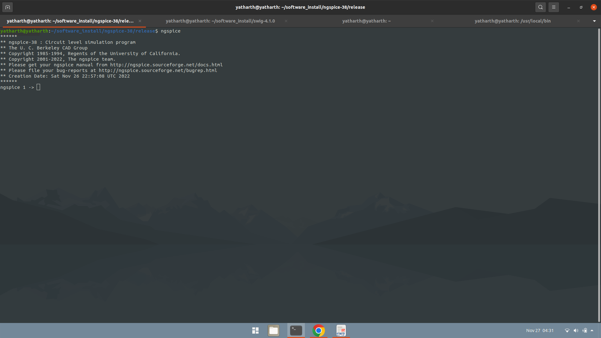

# VSD Hardware Design Program

## Index
* [Day 0 - Getting the tools](#Day-0---Getting-the-tools)

## Tools required during the project]
### yosys

### ngspice

### opensta

### icarus verilog

### gtkwave


## Chapter 1 - RTL DESIGN USING VERILOG WITH SKY130 TECHNOLOGY

The files used in this section can be cloned from: 

### 1.1 Using iverilog and gtkwave

Icarus Verilog or any other simulation program takes a verilog file and its corresponding testbench to produce a .vcd file.
vcd stands for value change dump and as the name suggests vcd files only track the output when there is a change in the input.

To generate the .vcd file
```
iverilog <specfile.v> <testbench.v>
```
The vcd file simulation can be seen in gtkwave using
```
gtkwave <file.vcd>
```
