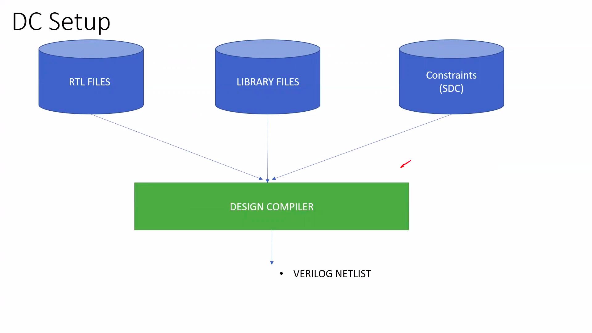

# VSD Hardware Design Program

This repository elaborates the process of an RTL to GDSII flow using OPENLane. it covers the various synthesis, floorplanning, routing amd timing specifications and steps required to fabricate the required circuit.

This repository contains the detailed theory for all the aforementioned steps and implements them to convert the RTL file for a RISC-V core with memory to the GDSII file for the SKY130 process.

<hr style="border:2px solid blue">

## File Directory 
    .
    ├── RTL_Design                 # Folder containing the files for all the tutorials.
    ├── Resources                  # Images used in the README.md
    └── README.md                  

<hr style="border:2px solid blue">

## Index
+ [Tools required during the project](#Tools-required-during-the-project)

+ [Chapter 1 - RTL DESIGN USING VERILOG WITH SKY130 TECHNOLOGY](#Chapter-1---RTL-DESIGN-USING-VERILOG-WITH-SKY130-TECHNOLOGY)
    - [1.1 Simulation Using iverilog and gtkwave](#11-Simulation-Using-iverilog-and-gtkwave)
    - [1.2 Logic synthesis using Yosys](#12-Logic-synthesis-using-Yosys)
    - [1.3 Understanding the .libs files](#13-Understanding-the-libs-files)
    - [1.4 Flop Coding](#14-Flop-Coding)
    - [1.5 Flop Simulation](#15-Flop-Simulation)
    - [1.6 Flop Synthesis](#16-Flop-Synthesis)
    - [1.7 Optimizations in Synthesis](#17-Optimizations-in-Synthesis)
    - [1.8 Combinational optimization in yosys](#18-Combinational-optimization-in-yosys)
    - [1.9 Sequential optimization in yosys](#19-Sequential-optimization-in-yosys)
    - [1.10 Unused sequential outputs optimization](#110-Unused-sequential-outputs-optimization)
    - [1.11 GLS and Simulation mismatch](#111-GLS-and-Simulation-mismatch)
    - [1.12 If, case, for loop and for generate synthesis issues](#112-If,-case,-for-loop-and-for-generate-synthesis-issues)
+ [Step 1 - VSDmemSOC RTL Simulation and GLS Verification](https://github.com/yathAg/VSD_Hardware_design/tree/main/VSDmemSOC#step-1---rtl-simulation-and-gls-verification)
+ [Chapter 2 - Understanding Constraints and Static Timing Analysis](#Chapter-2---Understanding-Constraints-and-Static-Timing-Analysis)  

    - [](#)


<hr style="border:2px solid blue">

## Tools required during the project
### yosys


<hr style="border:2px solid blue">

### Ngspice
ngspice is the open-source spice simulator for electric and electronic circuits.<br /><br />
Install steps:<br />

After downloading the tarball from [https://sourceforge.net/projects/ngspice/files/](https://sourceforge.net/projects/ngspice/files/) to a local directory, unpack it using:
```
 $ tar -zxvf ngspice-38.tar.gz
 $ cd ngspice-38
 $ mkdir release
 $ cd release
 $ ../configure  --with-x --with-readline=yes --disable-debug
 $ make
 $ sudo make install
```
More info can be found at [https://ngspice.sourceforge.io/index.html](https://ngspice.sourceforge.io/index.html)

Please note that to view the simulation graphs of ngspice, xterm is required and can be installed using.
```
$ sudo apt-get update
$ sudo apt-get install xterm
```

<hr style="border:2px solid blue">

### opensta

### icarus verilog

<hr style="border:2px solid blue">

### gtkwave

<hr style="border:2px solid blue">


## Chapter 1 - RTL DESIGN USING VERILOG WITH SKY130 TECHNOLOGY

The files used in this section can be cloned from: [https://github.com/kunalg123/sky130RTLDesignAndSynthesisWorkshop.git](https://github.com/kunalg123/sky130RTLDesignAndSynthesisWorkshop.git)

### 1.1 Simulation Using iverilog and gtkwave

Icarus Verilog or any other simulation program takes a verilog file and its corresponding testbench to produce a .vcd file.<br />
vcd stands for value change dump and as the name suggests vcd files only track the output when there is a change in the input.


iverilog is run with the following commands to output a.out file. this file can be executed to generate the .vcd file 
```
iverilog <specfile.v> <testbench.v>
```

The vcd file simulation can be seen in gtkwave using
```
gtkwave <file.vcd>
```


<hr style="border:2px solid blue">

### 1.2 Logic synthesis using Yosys
Logic synthesis defines converting the behavioral verilog code to an RTL code described using the vendor specific standard cells.<br />
These standard cells are described in the .lib file. The design file and the lib file are the inputs to the synthesizer tool.


Yosys is a synthesizer which produces the required rtl netlist, file which can again be verified using iverilog and gtkwave. <br/>
Since the netlist is true description of the design the same testbench file can be used for the netlist. 


A .lib contains multiple variants of a logic gate as fast and slow cells are required to meet the SETUP and HOLD times respectively.

Faster cells drive more current using transistors to charge and discharge the capacitive load in a circuit.
Fast cells have a low delay but consume more area and power due to wider transistors.

Steps for running Yosys are as follows

1. Load the library 
```
read_liberty -lib ../lib/sky130_fd_sc_hd__tt_025C_1v80.lib
```
2. Load the RTL design 
```
read_verilog good_mux.v
```
3. Declare the top module 
```
synth -top good_mux
```
4. Run the synthesis
```
abc -liberty  ../lib/sky130_fd_sc_hd__tt_025C_1v80.lib
```
5. Generate the verilog file using 
```
write_verilog -noattr good_mux_netlist.v
```

The output summary is shown as follows


---
A flow chart containing the used cells and the wires can be seen using the `show` command


---

The `-noattr` switch generates a clean netlist file


<hr style="border:2px solid blue">

### 1.3 Understanding the .libs files

Library name `sky130_fd_sc_hd__tt_025C_1v80`:
   -`sky130_fd_sc_hd` : process namePVT variations
   - `tt` - typical process from (slow, fast , typical) 
   - `025C` - temperature1.5 Flop Coding 
Hierarchical Synthesis considers and instantiates each module described in the design individually. The module may be optimized by the synthesizer using different gates while maintaining the same logic.Usually when a stacked PMOS can be replaced buy circuit with stacked NMOS the circuit will be more optimized.


---

The `flatten` command synthesis the design as described and eliminates the sub modules.


---

The sub modules can also be synthesized individually this has the following advantages
- If the design contains repeated sub modules, they do not need to be synthesizer multiple times
- Big designs can be broken down to small parts to reduce load on synthesizer 

<hr style="border:2px solid blue">

### 1.4 Flop Coding 

**Why are flops required ?**

Due to the propagation delay of combinational circuits the output has glitches. Flops between stages of combinational circuits make sure that there is a stable output and the glitches do not propagate.

**Set and reset signals**

To initialize the flop and have them in known state, set and reset signals are used to make the output 1 or 0 respectively 

**Asynchronous and synchronous signals**

asynchronous signals are independent of the clock and the output signal is changed immediately whereas in synchronous signal it changes on the next clock signal.


<hr style="border:2px solid blue">

### 1.5 Flop Simulation

**Asynchronous reset**


<hr style="border:1px solid blue">

**Asynchronous set**


<hr style="border:1px solid blue">

**Synchronous Reset**


<hr style="border:2px solid blue">

### 1.6 Flop Synthesis

During flop synthesis `dfflibmap -liberty ../lib/sky130_fd_sc_hd__tt_025C_1v80.lib` is used to map the library containing the flop standard cells.

**Asynchronous reset**


<hr style="border:1px solid blue">

**Asynchronous set**


<hr style="border:1px solid blue">

**Synchronous Reset**


<hr style="border:2px solid blue">

### 1.7 Optimizations in Synthesis 

**optimization in multipliers**


<hr style="border:1px solid blue">

**3 Bit number multiplied by 9**


<hr style="border:1px solid blue">

**Optimization in combinational logic**
Combinational logic can be optimized in 2 ways:-
1. When a signal in a combinational circuit is constant This is referred to as constant propagation.
2. Large combinational logics can be optimized using Boolean Logic optimization or K-MAPS.

**Optimization in sequential logic**

- When the Q out put does not change in a flop the sequential element can be removed. For ex. flop with async rest where D is tied to 0.
- State optimization : where unused states are optimized
- Cloning : When a output of a single flop is shared by 2 or more flops that are placed far apart in the layout, there might be errors due to delays in long interconnects. In such scenario the single flop is cloned and placed close to the driven flops to reduce delays.
- Re-timing : When the slack time due to combinational logic between flops limits the processing speed, the combinational logic is redistributed between flops to optimize the maximum operating frequency.

<hr style="border:2px solid blue">

### 1.8 Combinational optimization in yosys

`opt_clean -purge` is used before synthesis to optimize the designs<br />
<br />

<hr style="border:1px solid blue">

<br />

<hr style="border:1px solid blue">

<br />

<hr style="border:1px solid blue">

<br /><br />
Make sure to `flatten` designs with multiple submodules before running the optimization<br /><br />
<br />
<br />

<hr style="border:2px solid blue">

 ### 1.9 Sequential optimization in yosys


<br /><br />
---

<br /><br >
---

<br /><br />
---

<br /><br />

<hr style="border:2px solid blue">

 ### 1.10 Unused sequential outputs optimization

<br /><br />
---
<br /><br />

<hr style="border:2px solid blue">

 ### 1.11 GLS and Simulation mismatch

 GLS stands for gate level simulation where the synthesized netlist is validated against the testbench and the verilog models of the Logic Gates are giver for simulation.

 **Why GLS??**

 - It is useful for verifying the timing analysis of the generated netlist.
 - There might by Synthesis simulation mismatches between the design and the RTL netlist

 **Reasons for Synthesis Simulation mismatches**

 - Missing sensitivity List: In the verilog code if the appropriate inputs are not defined, the simulator will not analyze the changes for the missing signal in the sensitivity list.
 - Blocking and Non-Blocking statements : In blocking statements (a=b) the order of the statements matters and might result in incorrect synthesis. Therefore for sequential circuits non-blocking statements (a<=b) should be used.

Bad_mux Verilog <br />
<br />

Bad_mux simulation<br /> 
<br />

Iverilog can perform GLS by priding the RTL files as <br />
```iverilog ../lib/verilog_model/primitives.v ../lib/verilog_model/sky130_fd_sc_hd.v bad_mux_net.v tb_bad_mux.v```

Bad_mux synthesis simulation<br />
<br />

It is clearly seen that the design simulation and synthesis simulation are different due to ```missing sensitivity list``` in the always block

**blocking Statement mismatch**

Blocking_caveat Verilog and design simulation<br />
<br />

RTL simulation <br />
<br />

>Please make sure to use Non Blocking statements in sequential verilog codes to avoid such errors

<hr style="border:2px solid blue">

### 1.12 If, case, for loop and for generate synthesis issues

**Incomplete If Statements**

Incomplete If statements result in the formation of Latches hence it is important to define all the cases of an if case.
<br />
<br />

**Incomplete Case Statements**
<br />
**Complete Case Statements**
<br />
**Partial Case Statements**
<br />
**Repeated Case Statements**
<br />
<br />

<hr style="border:2px solid blue">
<br /><br />

## Chapter 2 - Understanding Constraints and Static Timing Analysis  

**What are constraints?**

A RTL code can be synthesized in multiple ways using the standard cells present. A constraint file guides the synthesizer to select the appropriate library cells to meet the timing and performance requirements.

**What is SDC?**

SDC stands for Synopsys Design Constraints which has become an industry standard for various design tools to specify the design constraints suring synthesis.

**Requirement of constraint files**

During synthesis a constraint file is provided along with the RTL and .lib to help the synthesis tool decide what flavour of the cell to use to optimize the design for performance and area.

<br />

<hr style="border:2px solid blue">

### Static timing analysis

+ Setup Time Requirement (Max Delay) 

This is the requirement required to meet the setup time of a flop.

`T<sub>clk</sub> > T<sub>CQ_A</sub>+T<sub>COMBI</sub>+T<sub>SETUP_B</sub>`

+ Hold Time Requirement (Min Delay)

This is the requirement to meet the hold time requirement of a flop.

`T<sub>HOLD_B</sub> < T<sub>CQ_A</sub>+T<sub>COMBI</sub>` 

<br />

**Parameters affecting Delay**

+ Higher inflow of current corresponds to a lower delay
+ Higher Load capacitance (output load) higher the delay.

<hr style="border:2px solid blue">
### Timing Arcs

+ combinational Cells
    -All the paths from input to output which leads to a delay.

+ Sequential Cell 
    - Delay from clk to Q for DFlop
    - Delay from clk to Q or D to Q for Dlatch
    - Setup and Hold times

<br />

<hr style="border:2px solid blue">

### Understanding timing paths & IO Modeling
There are different paths in a circuit which determine the critical path of a circuit.
The critical path is the path with the highest delay (slowest path) and determines the operating frequency of the circuit.

Starting points for the paths are:
+ Input Ports
+ Clk pins of Registers

End points of a timing path are:
+ Output ports
+ D pin of DFF/DLAT

This gives us 3 types of paths:
+ `Reg2Reg Timing path` 
    - Clk pin to D pin
    - Constrained by the clock
+ `IO Timing Path` 
    - Clk to Output or Input to D 
    - `Reg2Out` path constrained by external delay, output load and clock period.
    - `In2Reg` path constrained by input external delay, Input transition and clock period.
    - Modeling the above 2 paths is referred to as IO delay Modeling and has to be constrained for both max and min delay.
+ ` IO timing Path` - Input to Output ports. 

<br />
---
Based on the Clock period the synthesizer decides the maximum possible Combinational delay to meet the STA.

+ Practical Input transition period has to be accounted for Input Reg path
+ Output load has to be considered for external modules ( might be defined by spec) to meet reg output path.
+ Over modeling has to be avoided to prevent tool from using extra large cells, leaky cells or failing to synthesize path.


