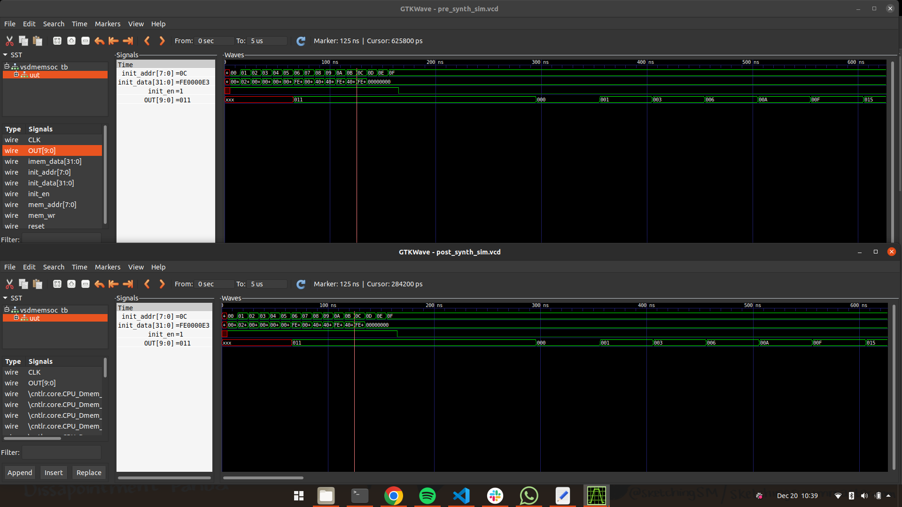

# VSDmemSOC RTL to GDSII

## File Directory 
    .
    ├── gds                 # SRAM GDS Model.
    ├── gls_model           # SKY130 PDK Verilog files
    ├── include             # include files for SOC Modeling
    ├── lib                 # SKY130 Standard cells and SRAM lib files
    ├── module              # SOC Verilog files
    ├── output              # Output files Produced during runtime
    ├── Makefile            # Makefile for executing steps during design flow
    ├── yosys.yc            # yosys run script
    └── README.md                  

## Make commands

+ `clean`               Removes the output Directory
+ `tlv`                 Generates verilog files from tlv using sandpiper
+ `pre_synth_sim`       RTL Simulation using iverilog
+ `synth`               Synthesizes netlist using YOSYS
+ `post_synth_sim`      GLS Simulation using iverilog

## Step 1 - RTL Simulation and GLS Verification

The RTL used for this project is the VSDmemSOC which is a single stage RISCV32 core with SRAM to store the instuction memory.

- Detailed explaination and the code for the SOC can be found here
- Detailed explaination and the code for the SRAM can be found here

The RVmyth core has been written in TLVeriog and first has to be converted to verilog files and this is done using sandpiper.
The command for the conversion is `sandpiper-saas -i rvmyth.tlv -o rvmyth.v --bestsv --noline -p verilog`  or `make tlv`

Once the verilog file is generated:
- Simulate the design using make `pre_synth_sim`
- Synthesize the design using `make synth`
- Simulate the gate level netlist `using make post_synth_sim`
- Compare the simulations using gtkwave
> Please make sure that the latest sky130_PDK libraries are used during the synthesis.

**Yosys Output**
 

**GLS Verification**
 
 

